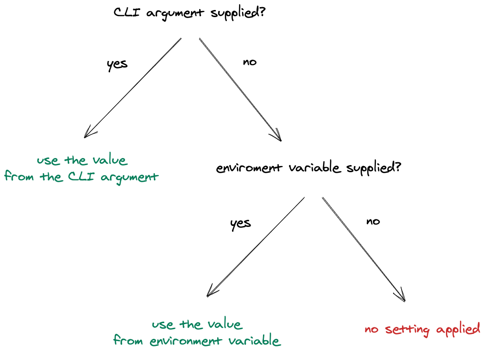

# 💻 Frontity CLI

The Frontity command-line tool (CLI\) is the main entry point for getting up and running with a Frontity application. It provides functionality like running a development server or building your Frontity application for deployment.

## How to use Frontity CLI

The Frontity CLI (Frontity commands\) is available via [npm](https://www.npmjs.com/package/frontity). You can run any Frontity command by doing `npx frontity <frontity-command>`

Run `npx frontity --help` for full help.

## Commands

The `frontity` commands you have available are:

### [Create commands](create-commands/README.md)

These commands will allow you to either create a Frontity project or a Frontity package

* [`create`](create-commands/create.md)
* [`create-package`](create-commands/create-package.md)

### [Run commands](run-commands/README.md)

These commands will allow you run a Frontity project in development or production mode

* [`dev`](run-commands/dev.md)
* [`serve`](run-commands/serve.md)

### [Build commands](build-commands/README.md)

These commands will allow you generate the code that can be used to run or analyze a Frontity project

* [`build`](build-commands/build.md)

### [Extra commands](extra-commands.md)

* [`subscribe`](extra-commands.md#subscribe)
* [`info`](extra-commands.md#info)


You can also use `--help` with each one of these commands to get more info about them: `npx frontity dev --help`


## Arguments & Environment Variables

The Frontity CLI allows parametrization via arguments or environment variables to customize their execution.

If some of these arguments or environment variables are detected the proper values will be set and applied in the execution of the command

## A typical workflow with Frontity commands

### In Development

1. Create a Frontity project: `npx frontity create my-cool-project`
2. Add a custom theme (package\): `npx frontity create-package my-custom-theme`
3. Launch a development server: `npx frontity dev`

### In Production

1. Generate a build of our project: `npx frontity build`
2. Launch our project in production using the build generated before: `npx frontity serve`

