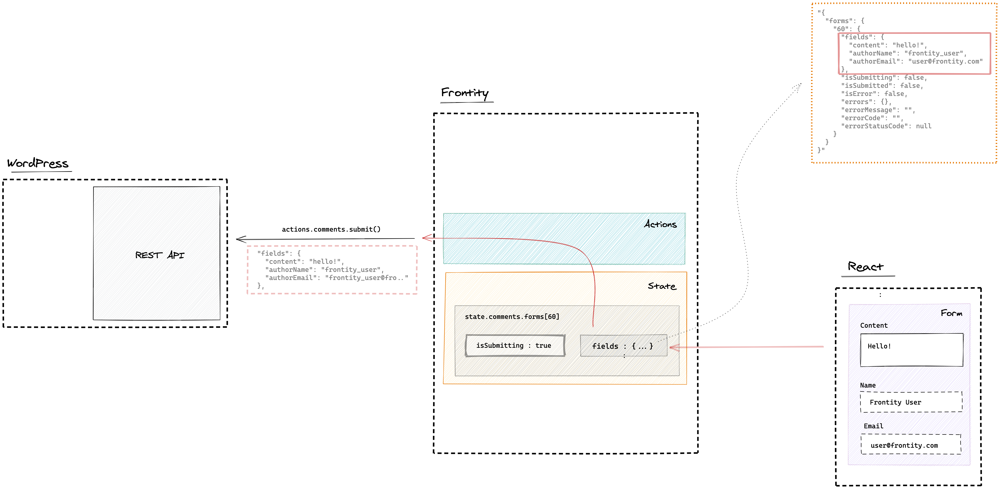

# `@frontity/wp-comments`

Comments package that adds integration for WordPress native comments.

<!-- toc -->

- [Installation](#installation)
- [Settings](#settings)
  - [In WordPress](#in-wordpress)
  - [In Frontity](#in-frontity)
- [Usage](#usage)
  - [Getting comments of a post](#getting-comments-of-a-post)
  - [Sending new comments for a post](#sending-new-comments-for-a-post)
- [API Reference](#api-reference)
  - [Handlers](#handlers)
    - [`@comments/:id`](#commentsid)
  - [State](#state)
    - [`state.comments.forms[]`](#state-comments-forms)
    - [`state.source.comment[id]`](#state-source-comment-id)
  - [Actions](#actions)
    - [`actions.comments.updateFields()`](#actions-comments-updatefields)
    - [`actions.comments.submit()`](#actions-comments-submit)
- [Demo](#demo)

<!-- tocstop -->

## Installation

Add the `wp-comments` package to your project:

```bash
npm i @frontity/wp-comments
```

## Settings

### In WordPress

In order to use this package, you will need to add a single line of configuration to your Wordpress installation:

```php
add_filter( 'rest_allow_anonymous_comments', '__return_true' );
```

[This filter](https://developer.wordpress.org/reference/hooks/rest_allow_anonymous_comments/) enables creating comments for anonymous users via the REST API.

You can add this that directly in your theme's `functions.php` file or use a [Code Snippets](https://wordpress.org/plugins/code-snippets/) plugin.

### In Frontity

This package doesn't have any configuration. It just needs to be added to the `packages` array in `frontity.settings.js`.

**`frontity.settings.js`**

```js
export default {
  packages: ["@frontity/wp-comments"],
};
```

## Usage

### Getting comments of a post

We can use the `@comments/:id` handler to fetch all the comments of a specific post (`actions.source.fetch("@comments/60")`).

This data will be populated to the state so then we can do `state.source.get("@comments/60")` to get the ID's of these comments.

```js
>> frontity.state.source.get("@comments/60/")
{
  "isFetching": false,
  "isReady": true,
  "link": "@comments/60/",
  "route": "@comments/60/",
  "query": {},
  "page": 1,
  "postId": 60,
  "items": [
    {
      "type": "comment",
      "id": 285
    },
    ...,

    {
      "type": "comment",
      "id": 274,
      "children": [
        {
          "type": "comment",
          "id": 276
        }
      ]
    },
  ...
  ],
  "total": 32,
  "totalPages": 1,
  "type": "comments",
  "isComments": true
}
```

With each ID we can get the details from the state at `state.source.comment[id]`

```js
>> frontity.state.source.comment[285]
{
  "id": 285,
  "parent": 0,
  "author": 0,
  "author_name": "mario",
  "author_url": "",
  "date": "2020-07-31T11:30:25",
  "content": {
    "rendered": "<p>Let&#8217;s see it</p>\n"
  },
  "link": "/2016/the-beauties-of-gullfoss/comment-page-5/#comment-285",
  "type": "comment",
  "author_avatar_urls": {...},
  ...
  }
}"
```



Have a look at this [diagram](https://excalidraw.com/#json=6489116225044480,z_EpwQgSmtB5DyqfPbce_Q) to learn more about this


### Sending new comments for a post

Every post with a comments' form (to send comments) will use `state.comments.forms[postId]` to store the data of the comment and the submission status

```js
>> frontity.state.comments.forms[60].fields
{
  "content": "This is nice",
  "authorName": "Jamie",
  "authorEmail": "jamie@gmail.com"
}
```

The data at `state.comments.forms[postId]` can be updated through the action `actions.comments.updateFields()`

```js
>> frontity.actions.comments.updateFields(60, { content: "Hello world!" });
>> frontity.state.comments.forms[60].fields
{
  "content": "This is nice",
  "authorName": "Jamie",
  "authorEmail": "jamie@gmail.com"
}
```

To send new comments you can use the action `actions.comments.submit()` which will send the data available at `state.comments.forms[postId].fields`

The submission status will be stored under under `state.comments.forms[postId]` and if there are errors they will be available at the properties `errorMessage`, `errorCode` and `errorStatusCode`




Have a look at these [diagrams](https://excalidraw.com/#json=6174729664724992,A-DM-LUhTX896Q3e_NW5vQ) to learn more about this


## API Reference

### Handlers

#### `@comments/:id`

This [`wp-source`](https://api.frontity.org/frontity-packages/features-packages/wp-source) handler gets all comments published in the specified post (using its ID) and creates a tree structure with comments and their replies in the data object.

For example, to fetch all comments that belong to the post with ID 60 you would do:

```js
await actions.source.fetch("@comments/60");
```

This would fetch all comments associated with that post and populate a data object inside the state (`frontity.state.source.data["@comments/60/"]`) with a tree structure of comments and replies, sorted by date (most recent first).


Have a look at the section [**Getting comments of a post**](#) to learn more


To access the fetched comments you could use something similar to this example:

```js
const Comments = connect(({ postId, state }) => {
  // Get comments from state.
  const data = state.source.get(`@comments/${postId}`);

  // Utility to render comments and replies recursively.
  const renderComments = (items) =>
    items.map(({ id, children }) => (
      // You should define your own <Comment/> component!
      <Comment key={id}>
        {/* Render replies */}
        {children && renderComments(children)}
      </Comment>
    ));

  // Render comments if data is ready.
  return data.isReady ? renderComments(data.items) : null;
});
```

### State

#### `state.comments.forms[]`

The `wp-comments` package stores in `state.comments.forms` a map of objects by post ID, each representing one comment form. These objects are intended to be used as the state of React `<form>` components and contain the input values as well as the submission status. They have the following properties:

| Name              | Type                               | Description                                                                                                     |
| ----------------- | ---------------------------------- | --------------------------------------------------------------------------------------------------------------- |
| **`fields`**      | [object](#the-fields-of-a-comment) | Form fields with their values.                                                                                  |
| `isSubmitting`    | boolean                            | The comment hasn't been received by WP yet.                                                                     |
| `isSubmitted`     | boolean                            | The comment has been received.                                                                                  |
| ` isError`        | boolean                            | The request has failed.                                                                                         |
| `errorMessage`    | string                             | Failure reason.                                                                                                 |
| `errorCode`       | string                             | The error code. Those are defined internally in the WordPress REST API. Example: `rest_comment_invalid_post_id` |
| `errorStatusCode` | number                             | The HTTP status code that might have been received from the WordPress REST API.                                 |

##### `state.comments.forms[].fields`

The following map of fields, representing the current field values that have been input in the form rendered in the given post. The content of this property is updated using the **`updateFields()`** action described later.

###### The fields of a comment

| Name          | Type   | Required | Description                                                    |
| ------------- | ------ | -------- | -------------------------------------------------------------- |
| `content`     | string | yes      | Content of the comment.                                        |
| `authorName`  | string | no       | Author's name.                                                 |
| `author`      | number | no       | The ID of the author.                                          |
| `authorEmail` | string | no       | Author's email.                                                |
| `authorURL`   | string | no       | URL of the author's site.                                      |
| `parent`      | number | no       | ID of the comment to which this one responds. Default Value: 0 |


Have a look at the section [**Sending new comments for a post**](#) to learn more


#### `state.source.comment[id]`

This is the portion of the state where the comments are stored after being fetched from the REST API or POSTed through the `comments.submit()` action

Thanks to the handler `@comments/:id` you can get the [ID's of the comments](https://github.com/frontity/frontity/blob/2eb98ae4e6fee1f93ac5af5c834a3add644ba7b0/packages/wp-comments/types.ts#L158) in a specific post.

With this list of ID's you can get the details for each one at `state.source.comment[id]`


Have a look at the section [**Getting comments of a post**](#) to learn more


_Example_

```js
const data = state.source.get(`@comments/${postId}`);

data.items
  .map(({ id }) => {
    // For each ID we can get the details of each comment at state.source.comment[id]
    const authorName = state.source.comment[id].author_name || "Anonymous";
    const content = state.source.comment[id].content.rendered;
    const date = state.source.comment[id].date;
    return { id, authorName, content, date };
  })
  .forEach(console.log);
```


Check a fully working example of [this](https://github.com/frontity-demos/frontity-examples/blob/master/wp-comments/packages/mars-theme/src/components/comments/comments-list.js) in [this `wp-comments` demo](https://github.com/frontity-demos/frontity-examples/tree/master/wp-comments).


### Actions

#### `actions.comments.updateFields()`

Update the fields of the form specified by `postId`. This action simply updates what is stored in `state.comments.forms[postId].fields` with the given values.

If no fields are specified, the form fields are emptied.

These fields will be used by `actions.comments.submit()` when submitting the comment

##### Syntax

```typescript
(postId: number, comment: object) => Promise;
```

##### Arguments

| Name           | Type   | Required | Description                                                                                                                                                                                                       |
| -------------- | ------ | -------- | ----------------------------------------------------------------------------------------------------------------------------------------------------------------------------------------------------------------- |
| _**`postId`**_ | number | yes      | The ID of the post where the comment will be published.                                                                                                                                                           |
| _`comment`_    | object | no       | Object representing the fields of the comment to be updated. A full list of the fields that can be sent as part of this object can be seen in the table at [The _fields_ of a comment](#the-fields-of-a-comment). |

```js
actions.comments.updateFields(60, {
  content: "Hello world!",
});
```


Have a look at the section [**Sending new comments for a post**](#) to learn more


#### `actions.comments.submit()`

This _asynchronous_ action publishes a new comment for the post specified by `postId`. It submits the fields stored in the respective form (i.e. `state.comments.forms[postId]`) or the fields passed as a second argument. If fields are passed, those replace the current values stored in `state.comments.forms[postId].fields`.

After calling this action, you can access `state.comments.forms[postId].isSubmitted` property(described above) to know the submission status.

Take into account this action does not validate input. That means requests are made even though some fields are empty or have invalid values. If that is the case, WordPress will return an error message and populate the error status accordingly.

##### Syntax

```typescript
(postId: number, comment: object) => Promise;
```

##### Arguments

| Name           | Type   | Required | Description                                                                                                                                                                          |
| -------------- | ------ | -------- | ------------------------------------------------------------------------------------------------------------------------------------------------------------------------------------ |
| _**`postId`**_ | number | yes      | The ID of the post where the comment will be published.                                                                                                                              |
| _`comment`_    | object | no       | Object representing the comment. A full list of the fields that can be sent as part of this object can be seen in the table at [The _fields_ of a comment](#the-fields-of-a-comment) |

```js
// Submit the comment to the post with ID 60
// using the values stored in `state.comments.forms[60].fields`.
await actions.comments.submit(60);

// Submit the comment to the post with ID 60
// using the values passed as the second argument.
await actions.comments.submit(60, {
  content: "This is a comment example. Hi!",
  authorName: "Frontibotito",
  authorEmail: "frontibotito@frontity.com",
});
```


Have a look at the section [**Sending new comments for a post**](#) to learn more


## Demo

This short video demonstrates the usage of the `@frontity/wp-comments` package.



The project used in the video is available [here](https://github.com/frontity-demos/frontity-examples/blob/master/wp-comments/README.md)
