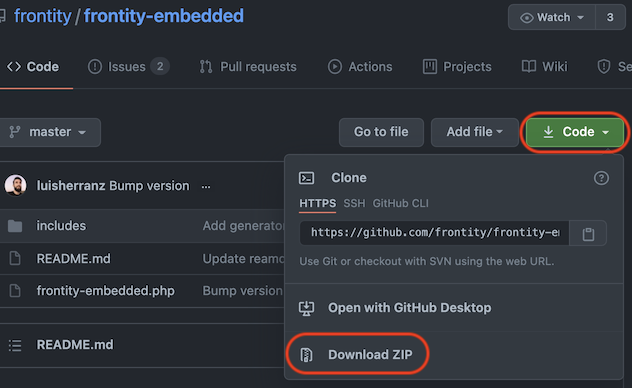
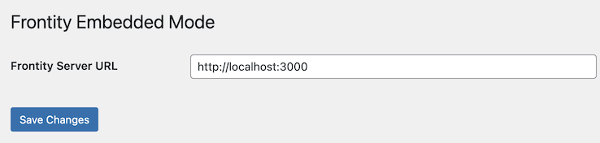

# Frontity Embedded Mode

This plugin enables an **Embedded Mode** implementation of Frontity.

- [Explore the code](https://github.com/frontity/frontity-embedded)
- [Download the zip](https://github.com/frontity/frontity-embedded/archive/refs/heads/master.zip)

Embedded Mode can be contrasted with **Decoupled Mode**. In Decoupled Mode the primary domain points to the Frontity site, with the WordPress site being on a secondary domain or on a subdomain of the primary domain.

In Embedded Mode the primary domain points to the WordPress site, and the Frontity site can be on another domain - including the default URL provided by a free hosting service such as [Vercel](https://docs.frontity.org/deployment/deploy-using-vercel).

This plugin replaces the active WordPress theme with the Frontity installation. Frontity therefore effectively becomes the WordPress sites' theme. It works by substituting it's own [`template.php`](https://github.com/frontity/frontity-embedded/blob/master/includes/template.php) in place of any call made to the [WordPress template hierarchy](https://developer.wordpress.org/themes/basics/template-hierarchy/).

## Advantages of Embedded Mode

Embedded Mode offers several advantages over Decoupled Mode.

- The WordPress site exists under the primary domain, thus ensuring that:
  - all the SEO benefits already built in to WordPress work as normal
  - existing SEO (for a site transitioning to Frontity) will not be affected
  - sitemaps generated by WordPress/Yoast/All-in-one-SEO work as normal
  - WordPress page cache plugins and hosting CDNs continue to work as normal
- Content producers/editors continue to have the same experience
  - post/page preview remains available
  - the admin bar is active for logged in users

## Disdvantages of Embedded Mode

- Frontity still needs to be hosted on a separate node server/serverless function (albeit on any domain you like including default domains provided by the hosting provider)
- WordPress still needs to go through it's [bootstrap process](https://wordpress.tv/2017/06/22/alain-schlesser-demystifying-the-wordpress-bootstrap-process/) on initial page load
- more routing is involved (WordPress makes a call to Frontity which returns the HTML to WordPress) so **a caching plugin is a necessity** rather than simply a nice to have.

## Installation

Installation is a three step process: Download → Install → Activate.

1. **Download** the zip file from [here](https://github.com/frontity/frontity-embedded/archive/refs/heads/master.zip).

2. **Install** the plugin by [uploading it to WordPress](https://wordpress.org/support/article/managing-plugins/#manual-upload-via-wordpress-admin)

3. **Activate** the plugin by locating it in the Plugins list and clicking on 'Activate'.

## Configuration

The only configuration necessary is the URL of the Frontity server.This can be configured in a variety of ways.

### Plugin settings page

Once the plugin has been activated a new 'Frontity Embedded Mode' option appears under 'Settings'.



Select this and enter the URL of the Frontity server in the input field. (During development this can be `http://localhost:3000`. In production this will be the deployed location of your Frontity site)



### Environment Variable

It is also possible to use an environment variable instead of changing the URL in the settings.

```bash
> FRONTITY_SERVER=https://myfrontityserver.com
```

> Note that the environment variable, if it exists, takes precedence over the setting configured in the settings page.

### WordPress Constant

Lastly a PHP constant can be defined. This would usually be done in the `wp-config.php` file.

```php
define( 'FRONTITY_SERVER', 'https://myfrontityserver.com' );
```

> Note that if the PHP constant exists, it takes precedence over both the environment variable and the settings page setting.

## Static Assets

By default Frontity will look for static assets (such as images, fonts, .js or .css files, etc...) in the path `https://<YOUR-DOMAIN>/static`.

However, since in Embedded mode the primary domain is pointing to the WordPress installation, Frontity will not find the static assets at this location.

In addition it's not always possible to host the static assets with the Frontity deployment - for example, if Frontity is deployed to a [serverless function](https://www.pubnub.com/blog/what-is-a-serverless-function/).

Therefore, if required, it's possible to change the directory or URL where your static assets are stored **at build time**. To do this you can use the [`--public-path` option](https://api.frontity.org/frontity-cli/build-commands/build#the-public-path-option) of the `npx frontity build` command.

> This changes [WebPack's `publicPath` configuration option](https://webpack.js.org/guides/public-path/).

### Examples

#### Example 1: Frontity in the same WordPress server

If you are using the same server for both WordPress and Frontity, and your Frontity project is at `/wp-content/frontity`, say, then your static folder will be at `https://yourdomain.com/wp-content/frontity/build/static`.

You can change the folder when you run `npx frontity build` thus:

```bash
> npx frontity build --public-path /wp-content/frontity/build/static
```

This ensures that Frontity will source it's assets from this location instead of from the default `https://<YOUR-DOMAIN>/static`.

#### Example 2: Frontity in an external server

If you've deployed Frontity to an external hosting service, for example Vercel, then you can use the `--public-path` option to point directly to the Vercel URL:

```bash
> npx frontity build --public-path https://myfrontityapp.vercel.app/static
```

## Local Development

If you want to use the Embedded mode while you are developing in your local environment, you can do so by using the `--public-path` parameter in the `npx frontity dev` command as well:

```bash
> npx frontity dev --public-path http://localhost:3000/static
```

## Feature Discussion

The development of this plugin was discussed in [this forum thread](https://community.frontity.org/t/embedded-mode/1432).
